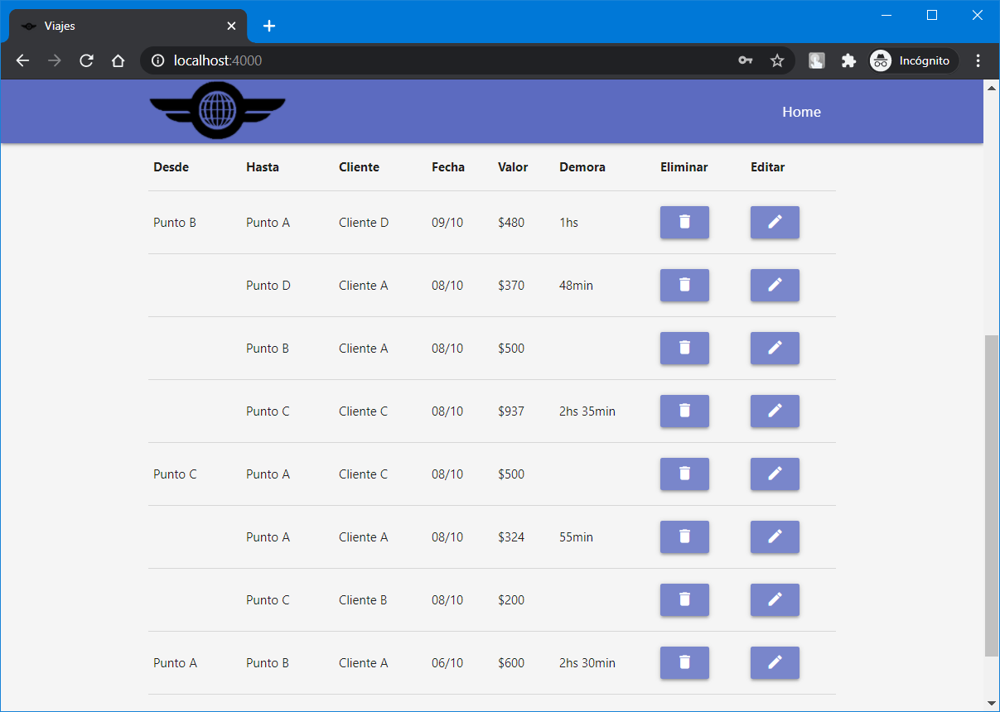

# Gestion de cadeteria
Aplicación web para la gestión contable de una pequeña empresa dedicada a la cadeteria administrativa

## Backend
  - [Node.js](https://nodejs.org/en/)
    - [Express](https://www.npmjs.com/package/express)
    - [Mongoose](https://www.npmjs.com/package/mongoose)
    - [JsonWebToken](https://www.npmjs.com/package/jsonwebtoken)
    - [Excel4node](https://www.npmjs.com/package/excel4node)
    - [Moment.js](https://www.npmjs.com/package/moment)
    - [Webpack](https://www.npmjs.com/package/webpack)
    - [Babel](https://babeljs.io/docs/en/next/babel-core.html)    
  - [MongoDB](https://www.mongodb.com/try/download/compass)

## FrontEnd
  - [React.js](https://reactjs.org/)
  - [Materialize](https://materializecss.com/)

## Screenshots

##### Pantalla principal

##### Exportar Excel

##### Excel

##### Login

##### Panel administración

